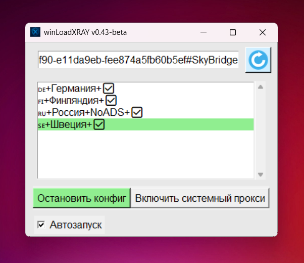

# winLoadXRAY ВПН клиент для Windows
VPN приложение для vless tcp reality и голых конфигов ядра XRAY на Windows 10 и 11 (на других не тестировал). 

По сути это python обертка вокруг готового [ядра XRAY](https://github.com/XTLS/Xray-core) для win64, также используется [tun2proxy](https://github.com/tun2proxy/tun2proxy) для tun режима.

**Умеет:**
- парсить подписку и запускать vless tcp reality и xhttp reality в mode:auto
- парсить голый vless://
- парсить чистый конфиг xray для клиента.

**Запускает:**
- socks5 прокси на 2080 порту
- системный прокси **(рекомендован для браузеров)**
- tun режим (от администратора)


## Внимание! Предустановлен роутинг для ру зоны, ру сайты в direct.

**Запустить:**
Скачайте последнюю версию ядра [XRAY](https://github.com/XTLS/Xray-core/releases) для Windows64 и положите рядом с файлом winLoadXRAY.py, скачайте последнюю вресию [tun2proxy](https://github.com/tun2proxy/tun2proxy) и положите в папку tun2proxy
```bash
cd C:\Xray-windows-64

python winLoadXRAY.py
```
**Сборка:**
```bash
pyinstaller --onefile --windowed --icon=icon.ico --add-binary "xray.exe;." --add-binary "geoip.dat;." --add-binary "geosite.dat;." --add-data "ico.png;." --add-data "icon.ico;." --add-data "logo.png;." --add-data "tun2proxy/tun2proxy-bin.exe;tun2proxy" --add-data "tun2proxy/tun2proxy.dll;tun2proxy" --add-data "tun2proxy/wintun.dll;tun2proxy" --add-data "tun2proxy/udpgw-server.exe;tun2proxy" winLoadXRAY.py
```


**Последняя версия скомпилирована с:**

https://github.com/XTLS/Xray-core/releases/download/v25.5.16/Xray-windows-64.zip


https://github.com/tun2proxy/tun2proxy/releases/download/v0.7.9/tun2proxy-x86_64-pc-windows-msvc.zip

**Скриншот:**




