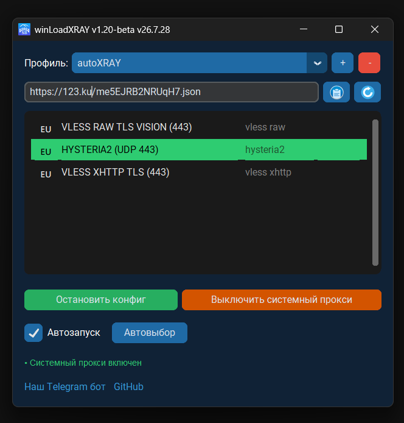

# winLoadXRAY ВПН клиент для Windows
VPN приложение для vless raw/xhttp reality/tls, hy2 и голых конфигов ядра XRAY на Windows 7/10/11.

По сути это python обертка вокруг готового [ядра XRAY](https://github.com/XTLS/Xray-core)


**Запускает**
- socks5 прокси на 2080 порту
- системный прокси


## Внимание! Предустановлен роутинг для ru зоны, ru сайты в direct.

**Запуск**

Зависимости: pip install pillow requests pyinstaller customtkinter pystray pywin32

Скачайте последнюю версию ядра [XRAY](https://github.com/XTLS/Xray-core/releases) для Windows64 и положите в папку xray
```bash
cd C:\Xray-windows-64 && python winLoadXRAY.py
```
**Сборка**
```bash
cd C:\Xray-windows-64 && pyinstaller --clean --onefile --windowed --icon=img/icon.ico --add-binary "xray/xray.exe;xray" --add-binary "xray/geoip.dat;xray" --add-binary "xray/geosite.dat;xray" --add-data "img/ico.png;img" --add-data "img/ref.png;img" --add-data "img/icon.ico;img" --add-data "img/logo.png;img" --add-data "func;func" winLoadXRAY.py
```


**Последняя версия скомпилирована с:**

https://github.com/XTLS/Xray-core/releases/download/v25.10.15/Xray-windows-64.zip


**Скриншот**



**Компиляция под WIN7**

Установить Python 3.8.10
```bash
cd C:\xray_win7 && py -3.8 -m venv venv_win7
venv_win7\Scripts\activate.bat
python --version
py -3.8 -m pip install --upgrade pip
py -3.8 -m pip install customtkinter pillow requests pystray pywin32 pyinstaller
```
Скачать и распаковать xray: https://github.com/XTLS/Xray-core/releases/download/v26.3.27/Xray-win7-64.zip

Запустить компиляцию.


Конфиги лежат тут:
%APPDATA%\winLoadXRAY